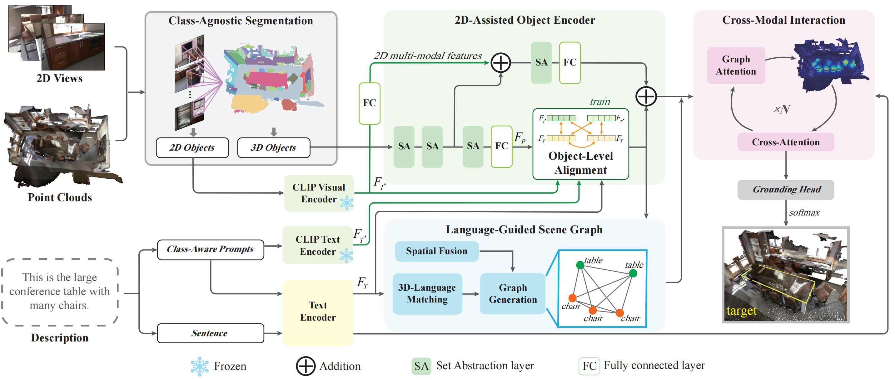

<div align="center">

# LSVG: Language-Guided Scene Graphs with 2D-Assisted Multi-Modal Encoding for 3D Visual Grounding
**Feng Xiao** · **Hongbin Xu** · **Guocan Zhao** · **Wenxiong Kang**  
*South China University of Technology*  

[Code](https://github.com/onmyoji-xiao/LSVG) | [Paper](#) | [Project Page](#)  



</div>


## Environment
```
git clone https://github.com/onmyoji-xiao/LSVG.git
cd LSVG/

conda create -n lsvg python=3.10
conda activate lsvg

pip install torch==2.2.1 torchvision==0.17.1 --index-url https://download.pytorch.org/whl/cu121
pip install -r requirement.txt

cd external_tools/pointnet2
python setup.py install

cd external_tools/open_clip
pip install -e .
```

## Data Preparation
### ScanNet v2
Download the [ScanNet V2](http://www.scan-net.org/) dataset.  
Prepare for ScanNet data and package it into "scannet_00_views.pkl" or "scannet_0x_views.pkl"
```
cd data
python prepare_scannet_data.py --process-only-zero-view [1/0] -scans_dir [scannet_path]
```
Download CLIP features from [Goolgle Drive](https://drive.google.com/drive/folders/18s5hvVmugVs2txlUhdNHumXYbZgRRDDj?usp=sharing)

```
-data/
  clip_feats_pad0.hdf5
  scannet_00_views.pkl
```

### Pretrained Model
Download [Bert Model](https://huggingface.co/google-bert/bert-base-uncased/tree/main)  
Download [CLIP-ViT-B-16-laion2B-s34B-b88K](https://huggingface.co/laion/CLIP-ViT-B-16-laion2B-s34B-b88K)

```
-pretrained/
  -CLIP-ViT-B-16-laion2B-s34B-b88K/
    ...
  -bert-base-uncased/
    ...
```

## Training
```
python train.py --cfg configs/nr3d.yaml
```

